<div align="center">
  
</div>

<div align="center">
  
</div>

<div align="center">
  <a href="https://github.com/Heptagon372">
    
  </a>
  <a href="https://github.com/Heptagon372?tab=followers">
    
  </a>
  
  
</div>

<br />


```ts
const heptagon: Developer = {
  name:     "윤승호 · Yoon Seungho",
  handle:   "@heptagon372",
  location: "Seoul, Republic of Korea",
  study:    "Software Convergence @ Sungkonghoe University",

  roles: [
    "Full-Stack Developer",
    "Infra & Platform Lead @ S.OWL Security Lab",
  ],

  focus: {
    web:   "shipping product-grade Next.js apps end to end",
    data:  "quant signals, public-data pipelines, backtesting",
    infra: "self-hosted clusters, reverse proxies, CI/CD",
  },

  currentlyBuilding: ["ATHENA", "L-STOCK", "NEO PET AI"],
  motto: "Succeed.",
};
```

> **7 vertices, one shape.** Product, data, and infrastructure are the same job to me —
> I like owning a thing from the schema all the way out to the deploy.

<br />


<div align="center">
  <sub><b>FRONTEND</b></sub>
  <br />
  
  <br /><br />
  <sub><b>BACKEND &amp; DATA</b></sub>
  <br />
  
  <br /><br />
  <sub><b>INFRA &amp; TOOLING</b></sub>
  <br />
  
  <br /><br />
  <sub><b>ALSO IN THE TOOLBOX</b></sub>
  <br />
  
</div>

<br />


<table>
  <tr>
    <td width="50%" valign="top">

### ⬡ ATHENA
Quant signal engine for the Korean equity market. Screening rules built from
published factor research, OpenDART financials for the quality/value layers,
and an 11.5-year backtest harness behind it.

`Next.js` `Python` `PostgreSQL` `OpenDART`

</td>
    <td width="50%" valign="top">

### ⬡ S.OWL Platform
The cybersecurity lab's site and member system — Google OAuth, a four-tier
role model, and row-level security all the way down. Dark-purple HUD UI.

`Next.js 15` `Supabase` `TypeScript` `RLS`

</td>
  </tr>
  <tr>
    <td width="50%" valign="top">

### ⬡ L-STOCK
A fan-made market simulator where the tickers are pro League of Legends
players across six regional leagues. Real data in: Leaguepedia, LoL Esports,
FX rates, news sentiment.

`Next.js` `Supabase` `REST APIs`

</td>
    <td width="50%" valign="top">

### ⬡ NEO PET AI
A desktop pet that actually watches your screen. A VLM narrates your
Minecraft session; parallel modality streams get fused with gated
cross-attention over episodic memory.

`PyQt6` `Python` `VLM`

</td>
  </tr>
  <tr>
    <td width="50%" valign="top">

### ⬡ ONNURI
Multilingual settlement app for foreign residents and international students
in Korea — concept, product spec, and full business plan.

`Product` `Research` `i18n`

</td>
    <td width="50%" valign="top">

### ⬡ Homelab / S.OWL Infra
Proxmox + LXC + nginx cluster, AWS EC2 game servers, and a closed-intranet
proposal written to survive the university's review board.

`Proxmox` `LXC` `nginx` `AWS`

</td>
  </tr>
</table>

<br />


<div align="center">
  
  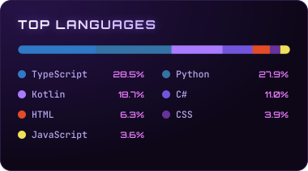
</div>

<div align="center">
  
</div>

<br />


<div align="center">
  
</div>

<div align="center">
  <picture>
    <source media="(prefers-color-scheme: dark)" srcset="https://raw.githubusercontent.com/Heptagon372/Heptagon372/output/snake-dark.svg" />
    <source media="(prefers-color-scheme: light)" srcset="https://raw.githubusercontent.com/Heptagon372/Heptagon372/output/snake.svg" />
    
  </picture>
</div>

<br />


<div align="center">
  <a href="mailto:heptagon372@gmail.com">
    
  </a>
  <a href="https://instagram.com/heptagon372">
    
  </a>
  <a href="https://github.com/Heptagon372">
    
  </a>
  <!-- Portfolio badge — un-comment once the site is live, and drop the URL in.
  <a href="https://your-portfolio.dev">
    
  </a>
  -->
</div>

<div align="center">
  
</div>
